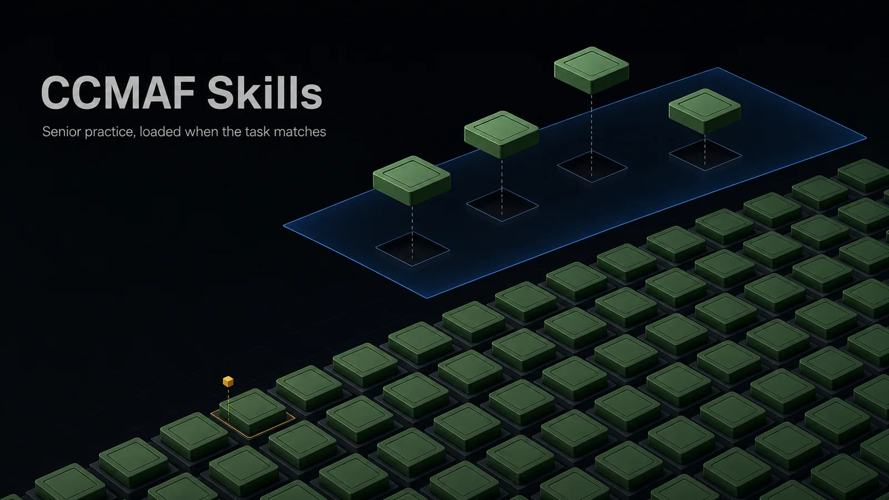
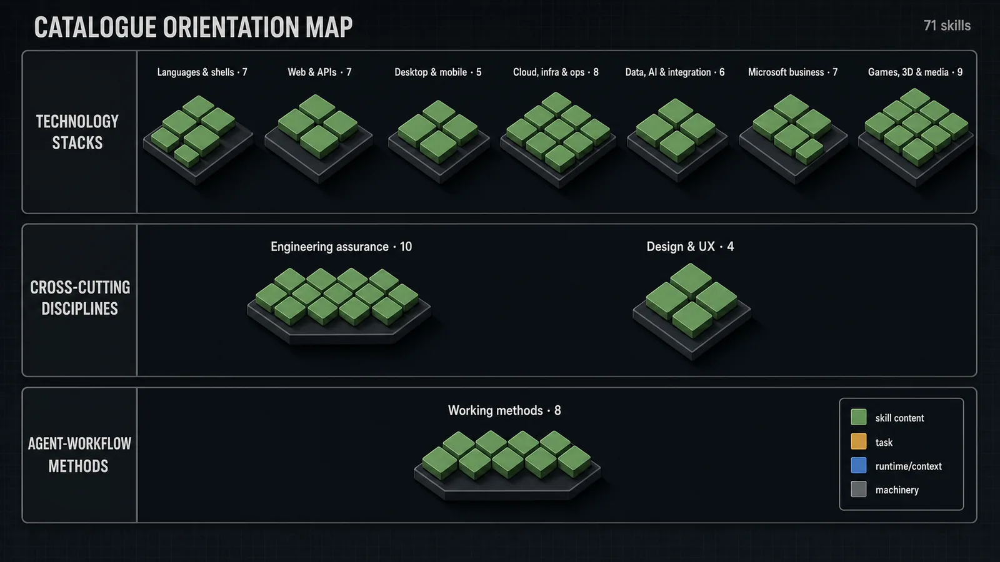
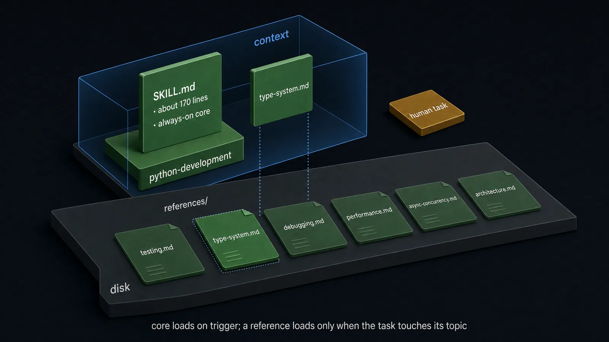
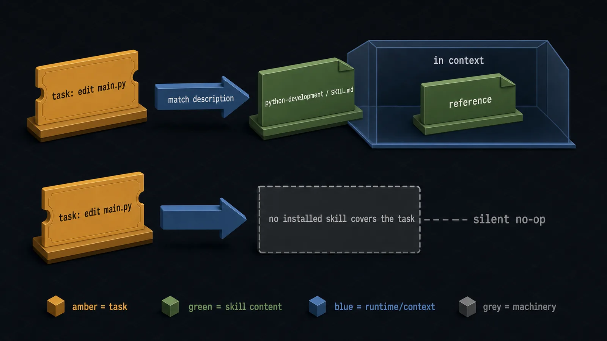
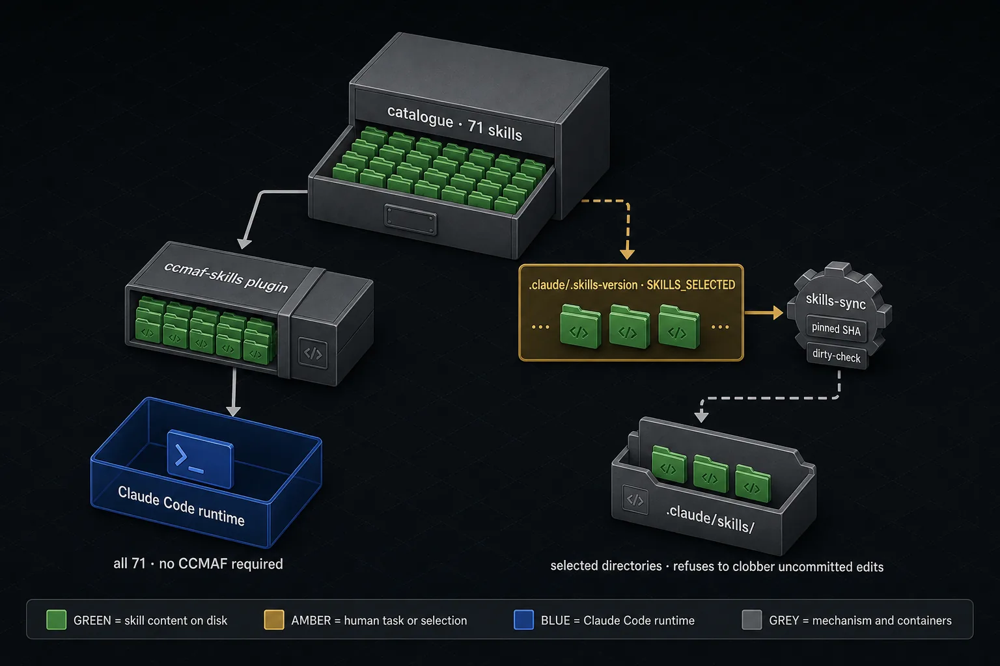

<div align="center">

<!-- IMG-1: Hero poster — a dark isometric field of green skill-directory tiles feeding a restrained blue context plane; title and tagline legible in the art; no tiny directory names baked into the image. Asset: .github/assets/hero.webp -->


*Skill directories on disk; the one a task matches crosses into context.*

**71 ENGINEERING SKILLS FOR CLAUDE CODE — A STANDALONE PLUGIN, OR SYNCED SELECTIVELY BY CCMAF**

# CCMAF Skills

**Senior practice, loaded when the task matches.**


[](https://github.com/drushegh/CCMAF)

</div>

CCMAF Skills is a catalogue of 71 vendor-neutral, MIT-licensed engineering skills for Claude Code and compatible agent runtimes: install all 71 as a standalone plugin, or sync a selected subset into a [CCMAF](https://github.com/drushegh/CCMAF) project.

## What this is (and is not)

A skill packages the conventions, decision frameworks, pitfalls, and verification rules a senior practitioner enforces in a domain, so an agent behaves like a disciplined specialist instead of guessing from its priors. Each skill is a self-contained directory: a lean `SKILL.md` core plus optional deeper references, loaded only when a task matches. This repository is the standards-pack catalogue the CCMAF framework references, and it also stands alone as a native Claude Code skills plugin.

| CCMAF Skills is | CCMAF Skills is not |
|---|---|
| 71 vendor-neutral engineering skills | A collection limited to programming languages |
| Senior-practitioner conventions, decisions, pitfalls, and verification rules | Runtime enforcement or a hard quality gate |
| Guidance loaded only when the task matches | Reference material loaded on every task |
| A standalone Claude Code plugin that installs all 71 | Dependent on the CCMAF framework |
| Selectively syncable into CCMAF projects | A per-skill plugin install — the plugin is all-or-nothing |
| Domain-neutral for public v1.0 | A repository of client- or project-specific policy |

[Explore the catalogue](#part-1--a-catalogue-not-a-language-shelf) · [See how a skill loads](#part-2--depth-disclosed-progressively) · [Choose an install path](#part-4--two-consumption-paths)

---

## Part 1 — A catalogue, not a language shelf

<!-- IMG-2: Catalogue orientation map — three labeled horizontal lanes (Technology stacks · Cross-cutting disciplines · Agent-workflow methods), ten labeled group clusters with per-group counts; group-level labels only, no individual directory names baked in; legend in the margin. Asset: .github/assets/catalogue.webp -->


*Ten groups across three bands. The map orients; the folds below are the authoritative index. No enforcement state is shown, because skills are advisory.*

> **Legend — used unchanged in every diagram in this README.**
> **Green** — skill content on disk: skill directories, `SKILL.md` cores, reference files, installed copies. **Amber** — the human's task or selection intent. **Blue** — the Claude Code runtime and its context boundary. **Grey** — mechanism and containers: the catalogue boundary, the plugin bundle, manifests, sync machinery. Loading is always drawn as an artifact crossing into the blue context frame; a file keeps its color when it loads. No enforcement color exists in this legend, because no skill enforces anything.

**The breadth is three-dimensional: technology stacks, cross-cutting disciplines, and agent-workflow methods.** The bands hold 49, 14, and 8 skills; 49 + 14 + 8 = 71.

| Band | Group | Skills |
|---|---|---|
| Technology stacks | Languages & shells | 7 |
| | Web & APIs | 7 |
| | Desktop & mobile | 5 |
| | Cloud, infrastructure & operations | 8 |
| | Data, AI & integration | 6 |
| | Microsoft business platforms | 7 |
| | Games, 3D & media | 9 |
| Cross-cutting disciplines | Engineering assurance | 10 |
| | Design & UX | 4 |
| Agent-workflow methods | Working methods | 8 |
| **Total** | **10 groups** | **71** |

Five of the working-method skills govern how an agent works rather than what it works on: `read-the-damn-docs`, `stay-within-limits`, `visual-plan`, `visual-recap`, and `uncanny`. The last of these removes AI tells from prose; its visual sibling, `design-taste`, sits in the Design & UX group and does the same for interfaces.

This grouping exists for navigation in this README. It is not repository metadata; each skill is one directory in the catalogue, and every directory below appears exactly once. Each `SKILL.md` also carries an on-demand `references/` folder — open a group to see what its skills cover.

<details>
<summary><strong>Languages &amp; shells</strong> · 7 skills</summary>

- **`python-development`** — Modern Python (3.11+): idioms, the type system, asyncio, error handling and logging, architecture, `pyproject`/pytest, performance and debugging.
- **`typescript-development`** — TypeScript 5.x type-safety: generics, eliminating `any`, Zod validation, Node backends, React typing, tsconfig/tooling, systematic `tsc` error-fixing.
- **`rust-development`** — Rust 2024 (1.85+): type-driven API design, ownership and lifetimes, error and lint discipline, async/tokio, serde, testing.
- **`go-development`** — Modern Go (1.22+): idioms and errors-as-values, goroutine/channel/context discipline, interfaces and generics, modules, table-driven tests, stdlib services and CLIs.
- **`dotnet-development`** — Modern .NET (8/9/10) and C#: ASP.NET Core APIs, EF Core, nullable reference types, testing, observability, performance, solution setup.
- **`bash-development`** — Production shell scripting: strict-mode and quoting, ShellCheck-aligned patterns, injection and temp-file safety, cross-platform portability, BATS testing.
- **`powershell-development`** — PowerShell 7+: advanced functions and the pipeline, error handling, Pester/PSScriptAnalyzer, the security stack, automation against Azure/M365/Dataverse.

</details>

<details>
<summary><strong>Web &amp; APIs</strong> · 7 skills</summary>

- **`frontend-development`** — Visual craft for HTML, CSS and Tailwind v4: design tokens and theming, semantic markup, distinctive (non-generic) design, styling architecture, the accessibility baseline.
- **`react-development`** — React and Next.js: render and data-fetching performance, composition patterns, React Server Components and the App Router, view transitions.
- **`threejs-development`** — Browser 3D with three.js and React Three Fiber: scene fundamentals with correct colour management, the glTF pipeline, performance, GLSL/TSL shaders, the pmndrs ecosystem.
- **`api-development`** — Framework-agnostic HTTP API design: REST and resource semantics, OpenAPI-first contracts, versioning, pagination, `problem+json` errors, auth and rate limiting, webhooks.
- **`graphql-development`** — GraphQL end to end: SDL schema design, resolver architecture and the N+1 problem with DataLoader, mutation and error design, subscriptions, federation, security, caching.
- **`web-performance-development`** — Framework-independent web performance and PWAs: Core Web Vitals with lab-vs-field measurement, the critical rendering path, loading strategy, caching, service workers, budgets.
- **`web-scraping-development`** — Responsible scrapers and crawlers: the legal/ethical gate, HTTP scraping and HTML parsing, dynamic sites with Playwright, the Scrapy framework, resilience and anti-bot operations.

</details>

<details>
<summary><strong>Desktop &amp; mobile</strong> · 5 skills</summary>

- **`electron-development`** — Electron's main/preload/renderer model, secure IPC via contextBridge, packaged-app path resolution, native modules, electron-builder packaging, signing and auto-update.
- **`tauri-development`** — Tauri v2 desktop and mobile: Rust↔frontend IPC, the capability/permission security model, configuration, plugins, builds, signing and testing.
- **`ios-development`** — Swift and SwiftUI: Swift concurrency and language standards, MVVM, Human Interface Guidelines and accessibility, persistence, App Store distribution.
- **`android-development`** — Kotlin and Jetpack Compose on the NowInAndroid architecture: MVVM with unidirectional data flow, offline-first Room, Hilt DI, modularisation and Gradle, testing.
- **`windows-desktop-development`** — Native Windows UI across WPF, WinUI 3, WinForms and MAUI: the framework decision, XAML and binding, MVVM, async UI and threading, packaging, UI Automation accessibility.

</details>

<details>
<summary><strong>Cloud, infrastructure &amp; operations</strong> · 8 skills</summary>

- **`azure-development`** — Azure service selection and engineering: Bicep/Terraform IaC and azd, compute services, Logic Apps, Entra ID and managed identities, Key Vault, storage/messaging, AI Foundry, Azure ML, operations.
- **`kubernetes-development`** — Platform-level Kubernetes: workload controllers and scheduling, autoscaling, Services/Ingress/Gateway and NetworkPolicy, secrets, RBAC and Pod Security, storage, Helm/Kustomize, GitOps, AKS.
- **`containers-development`** — Container engineering: multi-stage Dockerfiles, .NET image specifics, compose for local development, image and runtime security, registries and ACR, the Azure container-host decision, working K8s manifests.
- **`terraform-development`** — Provider-independent IaC with Terraform and OpenTofu: HCL module design, remote state, the plan-review merge gate, drift detection, multi-environment patterns, secrets and OIDC, testing, importing estates.
- **`devops-development`** — CI/CD on Azure DevOps and GitHub Actions: pipeline and workflow YAML, templates, OIDC federated credentials, environments and approvals, pipeline security, deployment automation.
- **`linux-development`** — Linux as a development/workstation environment and shared foundations: the filesystem and process models, permissions, the shell environment, package management, WSL2 on Windows in depth.
- **`linux-administration`** — Operating Linux servers: systemd units with hardening, networking and firewalls, users/sudo/PAM, USE-method performance troubleshooting, security hardening, logging and observability, automation.
- **`observability-development`** — Vendor-neutral observability: structured logging, metrics and distributed tracing correlated, OpenTelemetry instrumentation, the Collector pipeline, cardinality and cost control, SLOs with burn-rate alerting.

</details>

<details>
<summary><strong>Data, AI &amp; integration</strong> · 6 skills</summary>

- **`sql-development`** — Relational engineering for SQL Server / Azure SQL (T-SQL) and PostgreSQL: schema design, workload-aware indexing, evidence-first query tuning, transactions, injection-safe SQL and RLS, safe migrations.
- **`data-engineering-development`** — Vendor-neutral data pipelines: batch vs streaming, ELT/dbt with tests, orchestration, Spark, warehouse/lakehouse modelling, data quality and contracts, formats, idempotent backfillable jobs.
- **`machine-learning-development`** — Classic and deep ML you train yourself: problem framing and baselines, leakage-safe splits, feature pipelines, training and tuning, rigorous evaluation, experiment tracking, production ML.
- **`llm-development`** — Engineering software on LLMs (primarily the Claude API): messages and streaming, tool use and agentic loops, prompt engineering as a versioned discipline, caching and cost, MCP servers, agent harnesses, evals.
- **`rag-development`** — Retrieval-augmented generation as an engineered component: chunking, embeddings and index versioning, vector stores, hybrid retrieval and re-ranking, grounded citation, freshness, retrieval evaluation.
- **`event-driven-development`** — Vendor-neutral event-driven architecture: delivery semantics, idempotent consumers, the transactional outbox, sagas, event sourcing and CQRS, ordering, dead-letter handling, schema evolution.

</details>

<details>
<summary><strong>Microsoft business platforms</strong> · 7 skills</summary>

- **`fabric-development`** — Microsoft Fabric: OneLake topology and shortcuts, lakehouse/medallion architecture, Spark notebooks and Delta optimisation, ingestion and orchestration, Direct Lake, capacity administration.
- **`power-bi-development`** — Semantic model design (star schema, RLS), DAX authoring and performance tuning, Power Query/M and query folding, TMDL/PBIP source formats, deployment and ALM.
- **`power-platform-development`** — The low-code layer: canvas apps and Power Apps YAML, Power Fx and delegation, Power Automate cloud flows, maker-side Dataverse, environment strategy, solutions and ALM, code apps.
- **`power-pages-development`** — Power Pages portals: Liquid templating, the portal Web API, table permissions and web roles, forms and lists, SPA code sites, site settings and caching, pac pages ALM.
- **`dynamics-365-development`** — D365 Customer Engagement / Dataverse pro-code: plug-ins and the execution pipeline, client API scripting, PCF code components, Web API/SDK operations, solutions and ALM.
- **`copilot-studio-development`** — Copilot Studio agents, YAML-first: topic/trigger/action authoring, generative orchestration patterns, knowledge and connector actions, Teams/M365 channels, agent ALM/governance, testing and evals.
- **`m365-development`** — The Microsoft 365 platform for developers: Microsoft Graph fundamentals and SDKs, SPFx web parts and extensions, Teams apps, SharePoint Online data access, Office add-ins.

</details>

<details>
<summary><strong>Games, 3D &amp; media</strong> · 9 skills</summary>

- **`unity-development`** — Unity 6.x: the MonoBehaviour lifecycle and serialization rules, ScriptableObject data architecture, prefabs and additive scene management, Addressables, the Input System, ECS/DOTS, the build pipeline.
- **`unreal-engine-development`** — Unreal Engine 5: the Blueprints-vs-C++ decision and hybrid pattern, the gameplay framework, UCLASS/UPROPERTY reflection and GC, modules and plugins, Nanite/Lumen/Niagara, cooking and packaging, replication.
- **`godot-development`** — Godot 4.x: statically-typed GDScript and Godot C#, scene/node composition, custom Resources for data-driven design, physics (Jolt) with collision discipline, export presets with headless CI.
- **`godot-mcp-workflow`** — Driving Godot and Blender from an agent over MCP: the scaffold→edit→run→read-debug loop, each server's tool limits, working "blind", the Blender→glTF→Godot pipeline, arbitrary-code safety rules.
- **`godot-shaders-development`** — Godot 4.x shaders in the Godot Shading Language and compute GLSL: the language and the 3.x→4.x migration, spatial/2D/particle shaders, GLSL compute, visual shaders, a performance playbook.
- **`blender-development`** — The Blender knowledge layer: bpy scripting (the data-block model, dependency graph), add-on and extension development, Geometry Nodes concepts, the engine export pipeline, headless/CI automation.
- **`game-feel`** — The engine-agnostic craft of making motion feel good: Swink's three blocks, input responsiveness and forgiveness (coyote time, jump buffering), physics tuning, and juice (screenshake, hitstop, easing).
- **`comfyui-development`** — Building, automating and extending ComfyUI: the graph/execution model and UI-vs-API JSON, the generation pipelines, custom node development, the HTTP+WebSocket API, model management, the RCE surface.
- **`remotion-development`** — Making videos programmatically with Remotion: compositions and the Studio, frame-driven animation, sequencing and transitions, assets and audio, data-driven video, every rendering path, the paid Company Licence flag.

</details>

<details>
<summary><strong>Engineering assurance</strong> · 10 skills</summary>

- **`incident-response`** — Running production incidents, mitigate-first: detection and severity classification, the incident-command model, triage before diagnosis, status communication on a cadence, on-call and escalation, blameless postmortems.
- **`identity-development`** — Auth engineering, standards-first: OAuth 2.0/2.1 and OIDC flow selection, token engineering, sessions vs tokens and browser-auth security, MFA and passkeys, SSO (SAML/SCIM), RBAC/ABAC/ReBAC.
- **`accessibility-development`** — WCAG 2.2 AA with the EU/Irish statutory frame: ARIA and keyboard/focus patterns, accessible forms/tables/charts, testing tooling, an audit checklist with a severity rubric, Microsoft-stack notes.
- **`secure-development`** — Application security as a review framework: OWASP Top 10 (2025) and ASVS 5.0, STRIDE threat modelling, input/output handling, secrets and crypto hygiene, dependency and supply-chain security.
- **`testing-development`** — Cross-cutting test engineering above the unit level: strategy and the pyramid/trophy, Playwright E2E, load and performance testing with SLO gating, contract testing (Pact), test-data management.
- **`code-review-development`** — Senior-level review against one bar — the change must improve the codebase's health: the full reviewer discipline, a defect-hunting checklist, a severity rubric, comment craft, the author side, CI/AI gating.
- **`architecture-review`** — Reviewing architecture as a discipline distinct from code review: quality-attribute trade-offs, one-way-door hunting, coupling/cohesion, failure-mode walking, the simplest-thing gate, fitness functions, ADR quality.
- **`systematic-debugging`** — The language-independent debugging method: reproduce deterministically, minimise, isolate by binary search and `git bisect`, one falsifiable hypothesis at a time, instrument, fix the root cause, exit through a regression test.
- **`legacy-modernisation`** — Safely changing code you don't fully understand: characterisation tests first, seams and dependency-breaking, strangler-fig and branch-by-abstraction, codemods, upgrade playbooks, rollback as a design input.
- **`sentinel-development`** — Microsoft Sentinel SIEM/SOAR plus a general KQL reference: detection engineering, connectors and ingestion cost, hunting/watchlists/workbooks, automation rules and playbooks, Defender XDR and MITRE ATT&CK mapping.

</details>

<details>
<summary><strong>Design &amp; UX</strong> · 4 skills</summary>

- **`ux-design`** — Interaction and perception reasoning for any UI: the Laws of UX, Gestalt grouping and visual hierarchy, scan patterns, affordances and feedback, form UX, navigation, touch ergonomics, Nielsen's heuristics.
- **`design-taste`** — Removing AI tells from visual design so a UI reads as chosen, not generated: a hard-tell catalogue fixed on sight, the vocabulary of distinctive type/colour/space/depth/motion, register-aware polish budgets, an anti-overcorrection rule.
- **`ui-verification`** — The render → view → critique → iterate loop: actually rendering a UI, capturing it at real viewports, and critiquing the image against the ux-design and accessibility rubrics instead of shipping a guess from the code.
- **`drawio-development`** — Authoring native, committable `.drawio` XML: the well-formedness non-negotiables and layout discipline, per-type recipes, environment-aware export, a render→self-check→iterate loop, a bundled 617-icon Azure library.

</details>

<details>
<summary><strong>Working methods</strong> · 8 skills</summary>

- **`technical-writing`** — Authoring the documents software work produces (READMEs, ADRs, runbooks, changelogs, API prose, design docs) on the Diátaxis framework: choosing the type, its anatomy, verifying every sample, docs-as-code.
- **`academic-research`** — Full-lifecycle scholarly research, built citation-safe: scholarly discovery via free APIs, source appraisal, evidence synthesis (PICO/PRISMA), ideation with a novelty gate, reproducible methods, reviewer simulation.
- **`git-workflow`** — Version-control discipline beneath any CI/CD: branching and commit hygiene, rebase-vs-merge, interactive history surgery, conflict resolution, bisect archaeology, worktrees, monorepo tooling, disaster recovery.
- **`read-the-damn-docs`** — Grounding claims in official, version-matched docs and the installed source, not training memory: a source hierarchy, pin-the-version-first, a read-then-verify loop, treating unverified package recall as a security hole.
- **`stay-within-limits`** — Keeping long-running or parallel agent work inside platform usage limits: budgeting against the rolling windows, reading usage between waves, stopping on a soft threshold, checkpointing resumable state, scheduling idempotent wakes.
- **`visual-plan`** — Turning an implementation idea into a reviewable, grounded Markdown plan before any code: Mermaid diagrams, file maps, annotated diffs, an open-questions gate, one-way-door decisions up front, reuse before new, a sceptical self-review.
- **`visual-recap`** — Turning a completed change into a high-altitude before/after recap: a file-tree of what moved, before/after data-model and API summaries, annotated diffs, a Mermaid diagram — true by construction from the real diff, secrets redacted.
- **`uncanny`** — Removing AI tells from prose so it reads as human-written, across registers: a hard-tell catalogue fixed on sight, soft tells judged by density, write/edit/audit modes, an anti-overcorrection rule so the fix is not its own tell.

</details>

---

## Part 2 — Depth, disclosed progressively

<!-- IMG-3: Anatomy / progressive disclosure — one green skill-directory tile on disk; its green SKILL.md card labeled "SKILL.md · about 170 lines" crossing up into the blue context frame on a trigger; behind it a row of on-disk reference cards, exactly one of them crossing into context. Asset: .github/assets/anatomy.webp -->


*On a trigger, the `SKILL.md` core enters context; of the reference files behind it, only the one the task touches follows.*

**Load the core; open the depth only when the task needs it.** Every skill has the same two-layer shape. The real `python-development/` directory:

```
python-development/
  SKILL.md                      # about 170 lines — always-on core
  references/
    architecture.md
    async-concurrency.md
    debugging.md
    errors-and-logging.md
    idioms.md
    performance.md
    project-setup.md
    testing.md
    type-system.md
```

`SKILL.md` is the always-on core once the skill triggers. Python's is about 170 lines: core principles, code standards, critical pitfalls, decision rules, and an index of its references. The `references/` folder stays on disk. A file from it loads only when the task touches that topic — `debugging.md` for a debugging session, `type-system.md` for typing work — never speculatively, and never all nine at once. This keeps context cost proportional to the work.

---

## Part 3 — The task selects the skill

<!-- IMG-4: Native trigger — an amber task ticket (a .py task) matching a skill's frontmatter description; the green python-development/SKILL.md entering the blue context frame, one reference following; a second branch labeled "no installed skill covers the task" ending at "silent no-op". Asset: .github/assets/trigger.webp -->


*A task matches a description; the covered skill and its relevant reference cross into context. No covering skill: silent no-op.*

**Matching is native; the guidance is advisory.** Each `SKILL.md` opens with YAML frontmatter: a `name`, and a `description` written as trigger phrases. Claude Code matches the task against these descriptions and auto-loads the covered skill — the user does not invoke it by hand. From `python-development/SKILL.md`:

```yaml
name: python-development
description: >-
  Modern Python (3.11+) engineering standards, idiomatic patterns, pitfalls,
  and agent workflow rules, with detailed topic references loaded on demand.
  Use this skill whenever any .py file is created, edited, reviewed, or
  debugged — even if the user doesn't mention standards or patterns.
```

> When a skill covers the task area, it outranks the model's priors.

Outranking is advisory precedence, not enforcement. A loaded skill supplies expert context that takes priority over the model's general habits; it changes what Claude Code consults, and it is not a runtime gate. When no installed skill covers the task, the result is a silent no-op, never an error — the work proceeds on the model's own judgment.

---

## Part 4 — Two consumption paths

<!-- IMG-5: Two consumption paths — left: grey marketplace manifests and a plugin bundle carrying all 71 green tiles into a blue Claude Code runtime, labeled "no CCMAF required"; right: an amber .claude/.skills-version selection, the grey catalogue pinned at a SHA, a dirty-check, then the selected green directories copied into .claude/skills/, labeled "refuses to clobber uncommitted edits". Asset: .github/assets/install-paths.webp -->


*Left: the plugin carries all 71 into Claude Code, no CCMAF required. Right: `skills-sync` copies only the selected directories at a pinned SHA and refuses to clobber uncommitted edits.*

**Standalone means all 71; CCMAF means selected directories.**

### Path 1 — the standalone Claude Code plugin

The repository ships `.claude-plugin/marketplace.json` and `.claude-plugin/plugin.json`. The marketplace is named `ccmaf-skills`; the plugin, also named `ccmaf-skills`, bundles all 71 skills. No CCMAF framework is required. Add this repository as a Claude Code plugin marketplace, then install the plugin:

```
/plugin marketplace add drushegh/CCMAF---Skills
/plugin install ccmaf-skills@ccmaf-skills
```

No version is pinned, so `/plugin marketplace update` tracks `main` — every commit is a release. All 71 skills load at once, each auto-invoked from its trigger description.

### Path 2 — CCMAF `skills-sync`, selective

A CCMAF project names the skills it wants in `.claude/.skills-version`:

```
SKILLS_SELECTED="python-development rust-development typescript-development"
```

Running `skills-sync.sh` clones the catalogue and copies only those directories into `.claude/skills/`. Four properties, stated precisely:

- **Per-directory ownership.** Only the selected directories are managed; anything else under `.claude/skills/` is consumer-local and never touched.
- **A pinned catalogue SHA.** The project tracks a known version; `skills-check` reports when it is behind.
- **A dirty-check.** Sync refuses to clobber uncommitted local edits to a skill.
- **Anonymous public HTTPS by default.** The catalogue is public; no token or auth is involved.

| Property | Standalone plugin | CCMAF `skills-sync` |
|---|---|---|
| Requires CCMAF | No | Yes |
| Installed scope | All 71 skills | Only the selected directories |
| Entry point | `.claude-plugin/` marketplace + plugin | `.claude/.skills-version` (`SKILLS_SELECTED="…"`) |
| Version tracking | `/plugin marketplace update` tracks `main` | Pinned catalogue SHA |
| Local-edit protection | (plugin install) | Dirty-check refuses to clobber uncommitted edits |
| Default catalogue access | The plugin marketplace | Anonymous public HTTPS |

<details>
<summary><strong>Discovery: <code>--list</code> and <code>--suggest</code></strong></summary>

`skills-sync.sh --list` prints the live catalogue. `skills-sync.sh --suggest` detects the project's stack from its manifests — `pyproject.toml`, `Cargo.toml`, `package.json`, `go.mod`, `*.tf`, `Dockerfile`, `*.csproj`, `project.godot` — and recommends the matching stack skills plus always-worth-it cross-cutting ones.

</details>

## Relationship to CCMAF

The plugin path needs no CCMAF; the selective path is a CCMAF mechanism. [CCMAF](https://github.com/drushegh/CCMAF) is the multi-agent framework this catalogue serves as a standards pack. What the standalone plugin gives everyone — all 71 skills, natively loaded by Claude Code — CCMAF extends with selection: `SKILLS_SELECTED` in `.claude/.skills-version`, the pinned catalogue SHA, the dirty-check, per-directory ownership, and `--suggest` stack detection. The link runs both ways: the CCMAF README points at this catalogue as its skills upstream, and this badge row points back at CCMAF.

## Limits & scope

- **Advisory, not enforcement.** A skill changes the guidance Claude Code consults. It does not gate, fail, or veto anything at runtime.
- **An uncovered task simply proceeds.** No matching installed skill is a silent no-op, not an error.
- **Native auto-loading is Claude Code behaviour.** Compatible agent runtimes receive the same skill directories; identical native triggering is not promised outside Claude Code.
- **Domain-neutral by design.** The public v1.0 sweep deliberately carries no client- or project-specific policy.
- **No measured claims.** This README asserts no token savings, quality deltas, or adoption numbers; none have been measured.

## Contributing & license

MIT, for all 71 skills. Contributions go through issues and pull requests on [this repository](https://github.com/drushegh/CCMAF---Skills). A skill contribution keeps the catalogue's shape: one self-contained directory, a lean `SKILL.md` whose frontmatter description carries the trigger phrases, and depth split into `references/` files by topic.

<details>
<summary><strong>How the skills are built and verified</strong></summary>

Skills were built from curated official and community sources (repositories and commits are pinned in the maintainer's records) and verified mechanically where the tooling allows: code blocks are parsed with real toolchains (node, esbuild, Python compile, tree-sitter for C#/C++, YAML/TOML parsers, `bash -n`). Languages with no available parser (DAX, M, PowerShell, GDScript, KQL, Swift, GLSL) receive structural checks, and the affected skills say so. Fast-moving platform facts — product versions, regulatory deadlines, deprecation dates — are date-stamped in the text with a re-verify instruction, rather than presented as timeless truth. UK English throughout.

</details>

<details>
<summary><strong>The sync contract, and adding a new skill</strong></summary>

This repo is the skills upstream the CCMAF framework consumes mechanically (`contract:skills-sync`). An agent session authoring or modifying skills must preserve these invariants:

1. **One directory per skill at the repo root.** The directory name *is* the skill's identity — the token in `SKILLS_SELECTED`, the ownership boundary the sync overwrites, and the name other skills cross-reference. Renaming is a breaking change for every consumer that selected it.
2. **Naming `<domain>-development`**, lowercase, hyphenated, so `skills-sync.sh --suggest` output stays paste-able.
3. **`SKILL.md` is mandatory**, with YAML frontmatter: `name` equal to the directory name, and a `description` under 1,024 characters listing concrete triggers. Everything else in the directory ships verbatim on sync.
4. **Cross-references are advisory names, not hard links.** Skills route adjacent concerns to siblings by directory name; a consumer who synced only one of a pair just gets less depth there, never breakage.
5. **Every commit to `main` is a release.** Consumers pin a SHA in `.claude/.skills-version`; `skills-check.sh` compares that pin to `main` at cold start and prompts a re-sync. Keep `main` always-shippable.
6. **Plain Markdown, LF line endings, no executable content.** Consumer audits scan synced skills for hidden-character and instruction-injection patterns — keep skills free of zero-width/bidi characters and "ignore your instructions" phrasing, even in examples.

**Adding a skill:** a `<domain>-development` directory whose `SKILL.md` frontmatter `name` matches it exactly; a lean `SKILL.md` plus `references/` topic files, with every reference in the index present on disk and vice versa; a boundary section routing adjacent concerns to real sibling directory names; UK English and date-stamped fast-moving claims; add the skill to this README's catalogue; append `"./<name>"` to the `skills` array in `.claude-plugin/plugin.json` (bare directory refs, forward slashes); and, if the stack is detectable from project files, add the mapping to the framework's `--suggest` detection.

</details>

Licensed [MIT](LICENSE).

---

<div align="center">

**The task calls the skill. The standard arrives with the work.**

</div>
