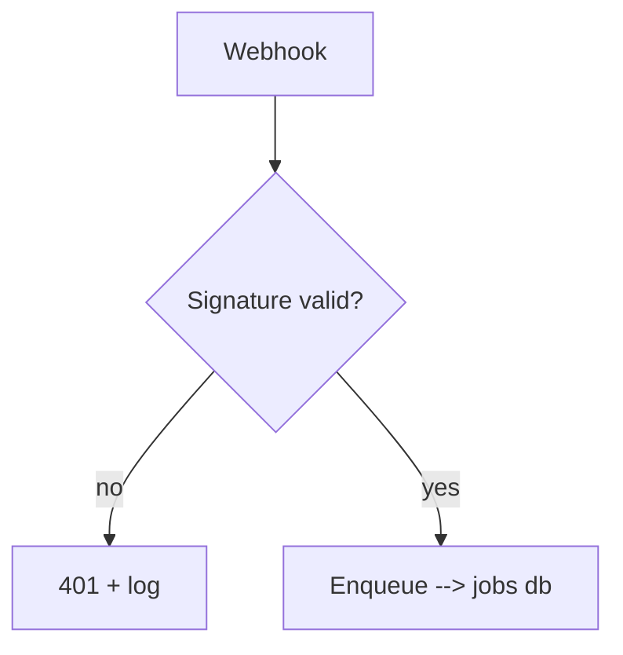
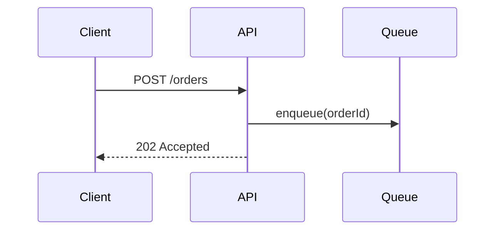
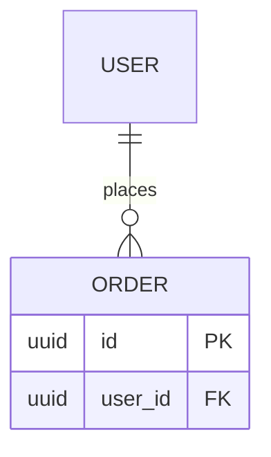
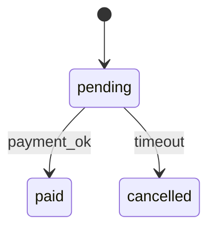
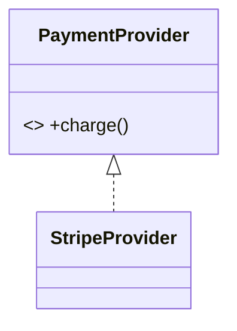
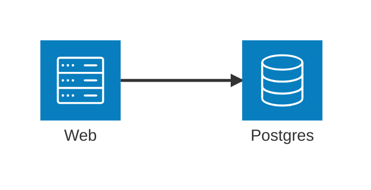

# Diagrams and wireframes

Picking and authoring the right visual primitive for a plan — which Mermaid type
*answers* which question, how to wireframe a UI before code exists, how to verify
it renders. Keep it in-plan: heavy exportable diagrams (auto-layout, brand icons,
PNG/SVG, committable `.drawio`) belong to `drawio-development`. Why these
primitives: Mermaid, ASCII and diff fences are plain text — they diff in a PR,
commit beside the code, render natively on GitHub/GitLab/VS Code, and an agent
parses them more reliably than a screenshot. A diagram you can't review line by
line isn't a planning artefact.

## Mermaid by planning question

Mermaid supports ~26 diagram types (verified June 2026; re-verify at
mermaid.js.org/syntax). Pick the one whose grammar *is* the question. Six earn
their place in a plan.

**`flowchart`** — *control flow / branching?*

**`sequenceDiagram`** — *what order do components call each other, async timing?*

**`erDiagram`** — *data model / schema change?* Name real tables and the new column.

**`stateDiagram-v2`** — *lifecycle / status machine?* A column moving through
fixed states with guarded transitions.

**`classDiagram`** — *type / class relationships?* Interfaces, inheritance,
composition the new code introduces.

**`architecture-beta`** — *system / deployment topology?* The `architecture-beta`
keyword arrived in v11.1.0+ (verified June 2026; re-verify at mermaid.js.org/syntax).
C4 still carries an experimental (caution) marker — prefer `flowchart` or
`architecture-beta` for topology unless you need C4 fidelity.


## ASCII / Unicode wireframes

For a UI change *before code exists*, a box-drawing wireframe is diffable and a
reviewer parses it more accurately than a screenshot. Use the set
`─ │ ┌ ┐ └ ┘ ├ ┤ ┬ ┴ ┼` and obey one iron rule: **it must align at monospace
width** — a wireframe that only lines up in a proportional editor is worse than
prose. Put it in a plain ` ``` ` fence (no language tag) so nothing reflows it.
```
┌─ New customer ──────────────────┐
│ Name   [____________________]   │
│ Email  [____________________]   │
│ Plan   ( ) Free   (•) Pro       │
│        [  Create  ]    Cancel   │
└─────────────────────────────────┘
```
Annotate intent in prose beside it (which control is primary, what's disabled
until valid) — the wireframe shows layout, the prose shows behaviour; how a
layout *behaves for a user* is `ux-design`. When ASCII is too coarse for the
fidelity needed (real proportions, a grid, overlap), a tiny static inline HTML
block (e.g. a flex row of bordered `div`s) is the next step up — still plain
text, diffable, no build step, a sketch not the implementation. Anything heavier
(brand icons, exportable assets) is `drawio-development`; rendering and
critiquing the result is `ui-verification`.

## File-trees and annotated fences

**Structural / layout change → a plain file-tree** (no-language fence), one note
per touched or new file:
```
src/payments/provider.ts   # new: PaymentProvider interface
src/payments/stripe.ts     # new: StripeProvider implementation
src/orders/service.ts      # edit: inject provider, call charge()
```
**The exact edit → a ` ```diff ` fence**, anchored to the *real* symbol names from
grounding (never invented), showing only the changed region. **A new signature →
a language fence** in the real language, matching the codebase's conventions.
```diff
 async function placeOrder(order: Order) {
+  await provider.charge(order.total)
   await save(order)
 }
```
```ts
interface PaymentProvider { charge(cents: number): Promise<ChargeResult> }
```

## Render-and-check before handoff

A broken diagram undermines the whole plan — a reviewer who hits a parse error
stops trusting the rest. Before you present: **validate every Mermaid block
parses** (paste into the live editor at mermaid.live or run a validator — never
ship one you haven't rendered); **view every ASCII block at monospace width** and
confirm the box characters line up, fixing any column that drifts; **re-read
every named symbol** in diffs, trees and ER blocks against the real repo, since a
diagram that contradicts grounding is worse than none; and **drop any visual that
doesn't earn its place** — no spatial relationship to show means prose is right.
