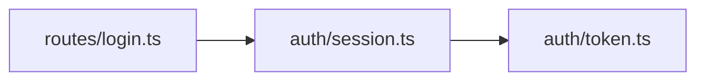

# Diff to blocks

How to build each recap block **mechanically** from the real diff. Every block is a
function of git/gh command output — run it, parse it, render the block. The model
writes only the captions and the *why*. If a claim isn't in the output, it doesn't
go in the recap (`grounding-and-security.md`).

## The git primitives

Pick the porcelain that emits exactly what each block needs — nothing inferred.

| Command | Emits | Use for |
|---|---|---|
| `git diff --name-status A...B` | one `A`/`M`/`D`/`R`/`C` flag + path per line | the `file-tree` change flags |
| `git diff --numstat A...B` | `added<TAB>deleted<TAB>path`, machine-parseable | churn ranking, picking key files |
| `git diff --stat A...B` | human diffstat (bars, totals) | a quick eyeball only — not for parsing |
| `git range-diff base A B` | a diff *of two diffs* | "what changed since the last review pass" |

```sh
git diff -z --name-status A...B    # R100 old<NUL>new<NUL> for renames
git diff -z --numstat     A...B    # added del path<NUL>; binary files show "-  -"
```

**Always pass `-z` when parsing.** Without it, records are newline-terminated and
fields tab-separated, so a path with a space/quote/non-ASCII byte is munged and a
rename appears as tab-separated `R100<TAB>old<TAB>new`, not an arrow. With `-z`, every field
is NUL-terminated and raw, so renamed/spaced/unicode pathnames parse losslessly — a
rename arrives as `R<score><NUL>old<NUL>new`; reassemble accordingly.

### Ranges: `..` vs `...`

This single choice scopes the whole recap:

- **`A..B`** — two-dot: every commit reachable from `B` but not `A`. If `A` (e.g.
  `main`) advanced since the branch forked, this *also* attributes main's new work
  to the branch.
- **`A...B`** — three-dot: diff against the **merge-base** (`git merge-base main
  feature`) — *what this branch introduces* on top of its fork point. Almost always
  what a recap wants; `gh` and a PR's "Files changed" use this semantics.

Using `..` where you meant `...` claims files the branch never touched.

**`range-diff` for re-review.** After a rebase/force-push the reviewer has seen v1
and needs only the *delta of the deltas*. `git range-diff main old-head new-head`
lines the two diffs up commit-by-commit — fixes applied, hunks dropped, lines
re-touched. Recap only that, not the whole diff again.

## The gh / GitHub primitives

- `gh pr diff <n>` — the PR's full unified diff to stdout (three-dot semantics);
  `--name-only` lists paths; `--exclude '*.lock' --exclude 'dist/**'` drops
  generated noise before you parse.
- `gh pr view <n> --json title,body,files` — title/body for the narrative and a
  changed-file list without fetching the whole diff.
- **GraphQL** `repository.pullRequest(number:).files(first:100, after:)` —
  paginate paths with `additions`/`deletions`/`changeType` via `pageInfo.endCursor`.
  Some surfaces cap a PR's file list around **300 files** (verified June 2026;
  re-verify at https://docs.github.com/graphql), so a giant PR truncates — fall back
  to local `git diff` for completeness.

## Mapping each change to a block

Each row is grounded in a command above — never inferred from prose or memory:

| Change in the diff | Source command | Recap block |
|---|---|---|
| files added/removed/renamed | `diff -z --name-status` | `file-tree`, one flag per entry |
| schema / migration change | the migration/DDL hunk | before/after `data-model` table |
| API / route / contract change | diff of the **OpenAPI document** | before/after `api-endpoint` |
| load-bearing code hunk | the hunk itself | split `diff` fence + caption + notes |
| brand-new file, no "before" | the file's added lines | annotated code fence |
| architecture / data-flow shift | changed modules + their imports | a `mermaid` diagram |

**File-tree → `--name-status`.** Map each flag to a marker and render the paths as a
tree; `R` carries both paths, so show the move. Don't hand-count totals — the tree
*is* the count.

```text
src/auth/token.ts       [A]
src/legacy/cookie.ts    [D]
src/routes/login.ts     [R] (was: routes/signin.ts)
```

**Schema → before/after `data-model`.** Build the table from the **migration or
DDL diff**, not an ORM model or a re-introspected database — the diff is the only
proof of the delta. Removed lines fill *before*, added lines *after*. Whether a
column add is safe, lock-taking, or backfill-needing is migration-safety judgement →
`sql-development`; here, render the diffed columns/types/constraints faithfully.

**API contract → before/after `api-endpoint`.** Diff the **contract artefact
itself** — the OpenAPI/Swagger document (`openapi.yaml`) — for method, path,
params, request/response schema, and status codes. Do **not** read these from
handler code: handler code is an implementation, not the contract, and routinely
drifts from it. If the spec file didn't change, the contract didn't change. OpenAPI
**3.2.0** is the current stable spec (verified June 2026; re-verify at
https://spec.openapis.org/); additive-vs-breaking classification → `api-development`.

**Load-bearing hunk → split diff + caption.** Quote the real hunk in a fenced
`diff` block (or a side-by-side split per `before-after.md`), add a one-line **"why
this matters"** caption, and annotate the changed lines — for the highest-risk files
only, never every hunk (that just rebuilds diff fatigue).

**Brand-new file → annotated code fence.** No meaningful *before*, so a split is
noise. Quote the new file's key section in a plain code fence, annotate the
load-bearing lines, and say it's new — never fabricate an empty "before" column.

**Architecture shift → Mermaid from real modules.** Generate the diagram from the
**modules that actually changed and the imports they added/removed** — read off the
diff, not imagined. A wrong diagram is the most dangerous block because it reads as
authoritative: confirm every node maps to a path in `--name-status` (a node with no
diffed file behind it is invented; delete it) and that it parses. GitHub renders
fenced ` ```mermaid ` inline in PR bodies and Markdown (verified June 2026; re-verify
at https://docs.github.com/get-started/writing-on-github); a richer exportable
diagram → `drawio-development`.


